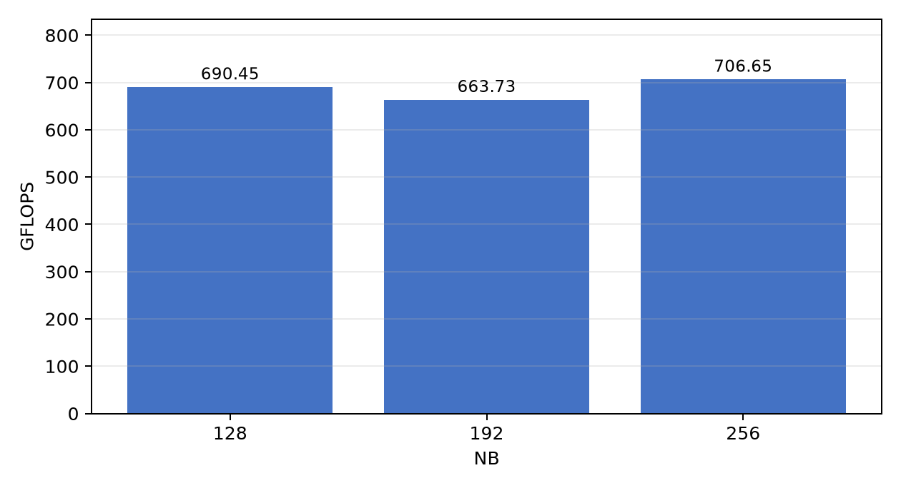

# HPL 参数测试

姓名：乔可傲  
年级专业：24绿算  
基础题：HPL

本仓库保存最终选拔基础题的配置、命令、完整日志和结果。HPL 源码与编译产物没有上传。

HPL 2.3 源码从 [Netlib](https://www.netlib.org/benchmark/hpl/) 获取，解压到 `/root/autodl-tmp/ASC_SELECTION/hpl-2.3/`。

## 环境

| 项目 | 内容 |
| --- | --- |
| 机器来源 | 自备付费云服务器（AutoDL / SeetaCloud） |
| 操作系统 | Ubuntu 22.04.1 LTS |
| CPU | Intel Xeon Gold 6348，分配 14 vCPU |
| 内存 | 120 GiB |
| 编译器 | GCC 11.4.0 |
| HPL | 2.3 |
| MPI | MPICH 3.4.3，`ch3:sock` |
| BLAS | OpenBLAS 0.3.20 |
| GPU | 未使用 |

系统自带的 OpenMPI 和 Ubuntu 软件源中的 MPICH 都会在 MPI 初始化时卡住。最终使用以下方式单独编译 MPICH：

```bash
tar -xf mpich-3.4.3.tar.gz
mkdir mpich-ch3-build
cd mpich-ch3-build
../mpich-3.4.3/configure \
  --prefix=/root/autodl-tmp/ASC_SELECTION/mpich-ch3 \
  --with-device=ch3:sock \
  --disable-fortran \
  --disable-cxx
make -j14
make install
```

编译 HPL 时使用仓库中的 `Make.a800_ch3`。如果目录不同，需要修改其中的 `TOPdir`、`CC` 和 `LINKER`。本次编译命令为：

```bash
cp Make.a800_ch3 /root/autodl-tmp/ASC_SELECTION/hpl-2.3/
cd /root/autodl-tmp/ASC_SELECTION/hpl-2.3
make arch=a800_ch3
```

## 运行方法

三组配置固定 `N=30000`、`P×Q=2×7`，只修改 `NB`。每个 MPI 进程使用一个 OpenBLAS 线程：

```bash
export OPENBLAS_NUM_THREADS=1
export OMP_NUM_THREADS=1
/root/autodl-tmp/ASC_SELECTION/mpich-ch3/bin/mpiexec -n 14 \
  /root/autodl-tmp/ASC_SELECTION/hpl-2.3/bin/a800_ch3/xhpl
```

也可以设置 `HPL_BIN` 和 `MPIEXEC` 后运行：

```bash
bash scripts/run_all.sh
bash scripts/extract_results.sh
```

## 结果

| 配置 | N | NB | P×Q | HPL 时间 / s | 性能 / GFLOPS | 残差 | 正确性 |
| --- | ---: | ---: | ---: | ---: | ---: | ---: | --- |
| 1 | 30000 | 128 | 2×7 | 26.07 | 690.45 | 1.32278729e-03 | PASSED |
| 2 | 30000 | 192 | 2×7 | 27.12 | 663.73 | 1.51325322e-03 | PASSED |
| 3 | 30000 | 256 | 2×7 | 25.47 | 706.65 | 1.40127525e-03 | PASSED |



三组结果都通过残差检查。`NB=256` 的性能最高，为 706.65 GFLOPS；与 `NB=128` 相比提高约 2.35%，与 `NB=192` 相比提高约 6.47%。所以在本次固定问题规模、进程数和进程网格下，`NB=256` 表现最好。

## 文件说明

- `configs/`：三组 `HPL.dat`。
- `logs/`：编译日志和三组完整运行日志。
- `results/results.csv`：汇总数据。
- `results/environment.txt`：机器和软件环境记录。
- `scripts/`：批量运行与结果提取脚本。
